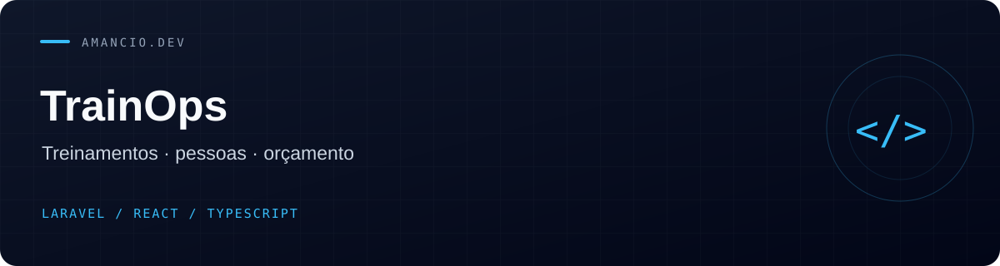

# TrainOps

Plataforma de gestão de treinamentos corporativos, pessoas e orçamento. Esta versão substitui o antigo PHP procedural/AdminLTE por uma aplicação Laravel moderna com React e TypeScript.

[Tecnologias](#stack) · [Funcionalidades](#funcionalidades) · [Instalação](#instalação-local) · [Qualidade](#qualidade)

## Stack

- Laravel 13 e PHP 8.3+
- Inertia 3, React 19 e TypeScript
- Tailwind CSS 4 e componentes Radix UI
- Laravel Fortify com recuperação de senha, verificação de e-mail, 2FA e passkeys
- SQLite para desenvolvimento; MySQL/MariaDB ou PostgreSQL em produção

## Funcionalidades

- Dashboard com colaboradores ativos, treinamentos, conclusão e utilização do orçamento
- Gestão de colaboradores com papéis `admin`, `manager` e `viewer`
- Catálogo de cursos, modalidades e cargos
- Fluxo de treinamento: planejado, aprovado, em andamento, concluído ou cancelado
- Composição detalhada de custos e vínculo ao orçamento anual
- Alertas ao atingir 80% do orçamento
- Busca, filtros, paginação e exportação CSV
- Auditoria de criação, edição e exclusão de dados
- Tema claro/escuro e layout responsivo

## Instalação local

Pré-requisitos: PHP 8.3+, Composer 2, Node.js 22+ e as extensões PHP exigidas pelo Laravel.

```bash
cp .env.example .env
composer setup
php artisan db:seed
composer dev
```

O seeder cria o primeiro administrador. Defina `TRAINOPS_ADMIN_EMAIL` e `TRAINOPS_ADMIN_PASSWORD` no `.env`. Se a senha não for informada, uma senha aleatória será exibida uma única vez no terminal.

Para MySQL, altere no `.env`:

```dotenv
DB_CONNECTION=mysql
DB_HOST=127.0.0.1
DB_PORT=3306
DB_DATABASE=trainops
DB_USERNAME=trainops
DB_PASSWORD=uma-senha-forte
```

## Qualidade

```bash
npm run lint:check
npm run format:check
npm run types:check
composer test
composer audit
```

O CI executa tipagem TypeScript, ESLint, Prettier, Laravel Pint, Larastan nível 7, PHPUnit e auditoria das dependências.

## Migração da versão antiga

O dump original foi removido da árvore atual porque continha dados pessoais e hashes SHA-1. O mapeamento das tabelas está documentado em `database/legacy/README.md`.

Recomenda-se migrar dados com um comando dedicado que:

1. normalize valores monetários para `decimal`;
2. remapeie usuários, cargos, cursos, modalidades, orçamentos e treinamentos;
3. invalide as senhas SHA-1 e envie recuperação de senha;
4. valide totais e chaves estrangeiras antes do corte.

Como o dump existiu no primeiro commit público, considere os dados expostos: redefina as senhas afetadas e, se necessário, remova o arquivo também do histórico Git com uma ferramenta de reescrita de histórico.

Leia [SECURITY_AUDIT.md](SECURITY_AUDIT.md) antes de implantar.

## Implantação

- `APP_ENV=production`, `APP_DEBUG=false` e HTTPS obrigatório;
- cookies `secure`, `http_only` e `same_site=lax`;
- banco, cache e filas com credenciais de privilégio mínimo;
- backup criptografado e restauração testada;
- `php artisan optimize` e `npm run build` durante a entrega;
- execute migrações com `php artisan migrate --force`.

## Licença

MIT.
